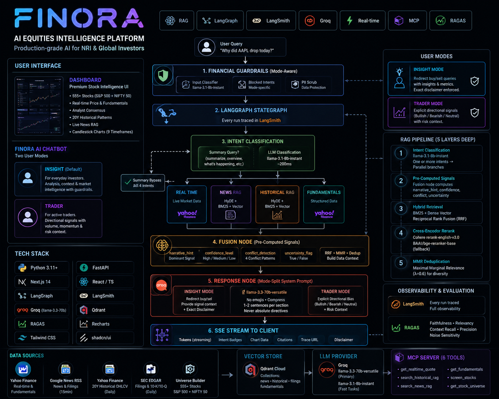

<div align="center">

<pre>
███████╗██╗███╗   ██╗ ██████╗ ██████╗  █████╗
██╔════╝██║████╗  ██║██╔═══██╗██╔══██╗██╔══██╗
█████╗  ██║██╔██╗ ██║██║   ██║██████╔╝███████║
██╔══╝  ██║██║╚██╗██║██║   ██║██╔══██╗██╔══██║
██║     ██║██║ ╚████║╚██████╔╝██║  ██║██║  ██║
╚═╝     ╚═╝╚═╝  ╚═══╝ ╚═════╝ ╚═╝  ╚═╝╚═╝  ╚═╝
</pre>

**Production-grade AI equities intelligence for NRI & global investors.**

*RAG · LangGraph · LangSmith · Groq · Recharts · MCP · Real-time · RAGAS*

---

[](LICENSE)
[](https://python.org)
[](https://nextjs.org)
[](https://langchain-ai.github.io/langgraph)
[](https://smith.langchain.com)
[](https://groq.com)
[](https://qdrant.tech)
[](https://github.com/explodinggradients/ragas)

</div>

---

## What Is Finora?

Finora is a **production-grade AI equities intelligence platform** built for NRI and global investors. Not a demo. Not a notebook. A real system built to production RAG standards — typed, traced, tested, and deployed.

**Two products in one:**

- **Dashboard** — Premium dark-mode stock intelligence UI covering 555+ stocks (S&P 500 + NIFTY 50). Real-time price, fundamentals, analyst consensus, 20-year historical patterns, live news RAG, and candlestick charts with 9 timeframes.
- **Finora AI** — Bottom-right floating chatbot with two user modes. Routes every query through a five-layer retrieval system: live market data, 20yr OHLCV patterns, news RAG, SEC filings, and structured fundamentals — fused, reranked, then sent to an intent-routed response engine. Every run traced in LangSmith.

---

## Finora AI — User Modes

The chatbot exposes two distinct behavioral modes, selectable in the chat panel:

### INSIGHT Mode (default)
For everyday investors. Provides analysis, context, and market intelligence. Buy/sell queries are redirected with a clear guardrail — the system surfaces what analysts say and key metrics instead of giving personal financial advice. Every guardrail response ends with the exact phrase: *"Consider consulting a financial advisor before making investment decisions."*

### TRADER Mode
For active traders. Provides explicit directional signals — bullish / bearish / neutral — grounded in volume, momentum, and technical context. Buy/sell queries receive signal-grounded analysis with risk context. No absolute directives ("you should buy") are ever given, but the system answers: *"momentum is bullish, volume confirms, key risk is..."*

Mode is sent with every request as `user_mode: "insight" | "trader"` and drives both the system prompt behavior and the guardrail routing — different blocked intent sets per mode.

---

## Architecture

<p align="center">
  
</p>

---

## RAG Pipeline — Five Layers Deep

### 1. Intent Classification
Every query → `llama-3.1-8b-instant` (~200ms) → one or more intents → parallel LangGraph branches:
`REAL_TIME | NEWS | HISTORICAL | FUNDAMENTAL`

**Summary bypass:** Queries matching "summarize", "overview", "what's happening", "explain this stock", etc. skip the LLM classifier entirely and return all 4 intents deterministically — no wasted LLM call, no mis-classification.

Multi-intent: *"Compare AAPL and MSFT earnings history"* → `[HISTORICAL, FUNDAMENTAL]` → 2 parallel branches run concurrently.

### 2. Pre-Computed Signal Layer (Fusion Node)
Before sending anything to the LLM, the fusion node deterministically computes:

- **`narrative_hint`** — dominant signal label: `sharp_downward_move | sharp_upward_move | high_volume_move | near_52w_high | near_52w_low | analyst_strongly_bullish | analyst_bearish | mild_upward_move | mild_downward_move | consolidating` — priority-ranked, not guessed
- **`confidence_level`** — `high` (3+ strong signals, 3+ data sources) / `medium` / `low`
- **`conflict`** — detects 4 conflict patterns: price down + analysts bullish, price up + analysts cautious, near 52W low + analysts bullish, near 52W high + target below price
- **`uncertainty_flag`** — true when confidence is low or unresolved conflict exists

These values drive the LLM prompt behavior — the model is told what signals dominate, not asked to figure it out. This eliminates hedging on high-confidence data and prevents fabrication on low-signal days.

### 3. Hybrid Retrieval — BM25 + Dense Vector + RRF
Dense vectors (MiniLM-L6-v2) catch semantic similarity. BM25 catches exact ticker/date matches. **Reciprocal Rank Fusion** merges both. BM25 catches "AAPL on 2022-01-14"; dense catches "when did Apple last see a similar drawdown."

### 4. Cross-Encoder Reranking
Over-retrieve 2× TOP_K → rerank with **Cohere rerank-english-v3.0** (primary) → falls back to `BAAI/bge-reranker-base` locally on rate-limit or failure. Cross-encoders see the full query-passage pair simultaneously — largest single quality improvement in any RAG system.

### 5. MMR Deduplication
Maximal Marginal Relevance (λ=0.6) ensures final TOP_K chunks are both relevant *and* diverse. Prevents the LLM from receiving 8 near-identical articles about the same catalyst.

---

## Intent-Routed Response Engine

Every query is not only routed through RAG layers — it is also classified into a **response intent** that selects the system prompt, token budget, and post-processing pipeline. This is independent of the RAG intent classification.

### Response Intents

| Intent | Triggers | Token Budget | Behavior |
|---|---|---|---|
| `metric` | Single financial fact — PE, EPS, price, yield | 400 | Returns the value with units. No narrative filler. Falls back gracefully when data is missing. |
| `explain` | "What is...", "How does...work", "Define..." | 600 | Clean educational explanation. Bypasses directional mode reasoning — concept definitions don't need a bullish/bearish stance. |
| `trade` | "Should I buy/sell", "entry point", "short this" | 800 | Mode-aware directional signal with risk context. Insight → redirects. Trader → explicit signal framing. |
| `summarize` | Everything else — analysis, overview, section queries | 1200–2500 | Full structured narrative with relevant sections. Section-focused queries trigger sub-intent narrowing (see below). |

### Sub-Intent Section Detection

Within `summarize`, Finora narrows the response to exactly the sections the user asked about:

```
"Apple risks"              → ## Key Risks only
"Apple valuation"          → ## Valuation only
"Apple valuation and risks"→ ## Valuation + ## Key Risks
"Apple cash flow"          → ## Cash Flow Generation only
"Apple latest news"        → ## Recent Drivers & News only
"Apple historical pattern" → ## Historical Parallels only
```

**Section keywords** are matched across 9 topic areas: `risks · business · cashflow · balance sheet · valuation · analyst · catalysts · historical · news`

**Semantic expansion** handles paraphrased intent without extra LLM calls:
- "downside", "go wrong", "threat" → `risks`
- "cheap", "expensive", "priced" → `valuation`

**Full-analysis override:** When the query contains "analyze", "analysis", "deep dive", or "full analysis", section narrowing is suppressed even if section keywords appear — *"Apple looks expensive but growing fast — analyze"* produces a full multi-section summary, not just the valuation section.

### Hard Section Enforcement

The LLM is instructed to generate only the requested sections via a `CRITICAL FOCUS` block injected before the output template. A post-processing filter (`_enforce_sections`) then strips any `##` headers that fall outside the requested set — LLM compliance is not trusted for this constraint.

### RAG Data Layer Routing

Both mode system prompts include explicit `DATA LAYERS` routing tables that tell the LLM which RAG layer maps to which output section:

```
[REAL-TIME]     → Current Price & Movement, Today's Story
[NEWS]          → Recent Drivers & News, Catalysts
[HISTORICAL]    → Historical Parallels (MUST include if present)
[FUNDAMENTALS]  → Valuation, Business Model, Cash Flow, Balance Sheet
```

This prevents the LLM from inventing data for a section when that layer returned nothing — it knows to skip the section rather than hallucinate.

### Token Budget Management

All token budgets include a **20% buffer** applied at runtime: `max_tokens = int(max_tokens * 1.2)`. This prevents mid-sentence truncation on responses that slightly exceed the base limit. Multi-section queries use the maximum token budget across all requested sections.

### Graceful Terminal Fallback

When the output guardrail or section enforcement reduces the response below the minimum threshold, the system extracts readable lines from `fused_context` and returns a partial-data answer rather than a dead-end error message.

### Follow-up Suggestions

Every response (all intents including metric) includes 3 follow-up question chips after the answer — max 8 words each, covering different angles. Suggestions are extracted from a `---SUGGESTIONS---` delimiter in the LLM output and passed as a separate SSE event to the frontend.

---

## Chat Features

- **INSIGHT / TRADER mode toggle** — in chat panel header; drives entire response behavior
- **Streaming SSE** — token-by-token with intent badges shown during retrieval
- **Intent-routed response engine** — metric / explain / trade / summarize with per-intent prompts and token budgets
- **Multi-section sub-intent detection** — "Apple valuation and risks" → two sections, not one
- **Full-analysis override** — explicit "analyze" / "deep dive" queries always produce full summaries
- **"Summarize this stock" chip** — prominent primary chip; triggers full structured narrative across all 4 RAG branches
- **Context-aware suggestion chips** — 3 follow-up questions on every response, auto-generated, max 8 words
- **Narrative-first structure** — every response leads with the dominant signal, not a generic opening
- **Guardrail redirects** — INSIGHT mode buy/sell queries get signal context + exact disclaimer phrase, never a refusal
- **Conversation memory** — last 4 turns injected into fusion prompt for contextual follow-ups
- **Dynamic price charts** — embedded Recharts AreaChart matched to the query timeframe (1D intraday through ALL 20yr)
- **Finance bar charts** — Revenue vs Net Income over 5 fiscal years, shown on financial history queries
- **Smart citations** — news sources shown only on queries with news/movement intent
- **SEBI/SEC disclaimers** — auto-injected, locale-aware, only on directional language
- **Early response cache** — TTL-based cache bypasses the full graph on repeated queries
- **LangSmith trace link** — every response includes a clickable ↗ trace link in the UI

---

## Stack

| Layer | Technology |
|---|---|
| **Frontend** | Next.js 14 App Router · TypeScript · Tailwind CSS · shadcn/ui |
| **Charts** | Recharts — candlestick OHLCV + dynamic chat area charts + finance bar charts |
| **Backend** | FastAPI · Python 3.11 · Pydantic v2 · Uvicorn |
| **Agent Graph** | LangGraph 0.2 StateGraph — parallel branches, typed state |
| **RAG** | LangChain v0.3 · Hybrid BM25+Dense · HyDE · Cohere rerank · BAAI fallback |
| **Response Engine** | Intent-routed prompts · Multi-section detection · Hard section enforcement · Token buffering |
| **Observability** | LangSmith — every graph run traced |
| **RAG Evaluation** | RAGAS 0.2.5 — faithfulness, answer relevancy, context recall, context precision, noise sensitivity |
| **LLM Primary** | Groq `llama-3.3-70b-versatile` — response generation |
| **LLM Fast** | Groq `llama-3.1-8b-instant` — intent classification, guardrails, HyDE |
| **Embeddings** | HuggingFace `all-MiniLM-L6-v2` — local, free, no API key |
| **Vector Store** | Qdrant Cloud (free 1GB cluster) |
| **MCP** | FastMCP server — 6 tools: quote, historical RAG, news RAG, fundamentals, screener, universe |
| **Real-time Data** | Yahoo Finance via `curl_cffi` Chrome TLS impersonation — no API key needed |
| **News** | Google News RSS — live, locale-aware (NSE/BSE for Indian stocks) |
| **Historical** | 20yr weekly OHLCV via Yahoo Finance → FinancialEventChunker → Qdrant |
| **Scheduling** | APScheduler — news every 15min, historical daily |
| **Guardrails** | `llama-3.1-8b` input classifier + mode-aware blocked intents + hallucination check + PII scrub |
| **Deploy** | Vercel (frontend) · HuggingFace Spaces Docker (backend) |

---

## Project Structure

```
finora/
├── CLAUDE.md
├── docker-compose.yml
├── finora-backend
│   ├── backend
│   │   ├── api
│   │   │   ├── middleware
│   │   │   │   ├── guardrails.py
│   │   │   │   └── rate_limit.py
│   │   │   └── routes
│   │   │       ├── chat.py           ← SSE streaming, chart data, citation gating
│   │   │       ├── health.py
│   │   │       └── stocks.py
│   │   ├── data
│   │   │   ├── eval_results/
│   │   │   └── universe/stocks.json  ← 555 stocks, committed
│   │   ├── finora_mcp
│   │   │   ├── server.py
│   │   │   └── tools/               ← 6 MCP tools
│   │   ├── graph
│   │   │   ├── finora_graph.py       ← LangGraph StateGraph master definition
│   │   │   ├── state.py
│   │   │   └── nodes
│   │   │       ├── intent_classifier.py
│   │   │       ├── realtime_node.py
│   │   │       ├── news_rag_node.py
│   │   │       ├── historical_rag_node.py
│   │   │       ├── fundamentals_node.py
│   │   │       ├── fusion_node.py    ← Pre-computed signals, conflict detection
│   │   │       ├── response_cache.py ← TTL-based early response cache
│   │   │       └── response_node.py  ← Intent-routed engine, section detection
│   │   ├── guardrails
│   │   │   ├── classifier.py         ← llama-3.1-8b safety classifier, mode-aware
│   │   │   ├── output_filter.py      ← Hallucination check, PII scrub, disclaimers
│   │   │   └── disclaimers.py
│   │   ├── observability
│   │   │   ├── langsmith_client.py
│   │   │   └── langsmith_url.py
│   │   └── rag
│   │       ├── chunking/             ← SlidingWindow, Semantic, FinancialEvent
│   │       ├── evaluation/           ← RAGAS runner + synthetic QA generator
│   │       ├── ingestion/            ← Historical, news, filings, universe
│   │       ├── retrieval/            ← Hybrid, HyDE, reranker, MMR dedup
│   │       └── yahoo_client.py       ← curl_cffi Chrome TLS impersonation
│   ├── scripts/                      ← build_universe, ingest_*, eval_rag
│   ├── Dockerfile
│   └── requirements.txt
├── finora-frontend
│   ├── app
│   │   ├── dashboard/[ticker]/page.tsx
│   │   └── eval/page.tsx             ← RAGAS results UI
│   ├── components
│   │   ├── chat
│   │   │   ├── ChatWidget.tsx        ← FAB + slide-up panel + mode toggle
│   │   │   ├── ChatMessage.tsx       ← Markdown · AreaChart · BarChart · citations
│   │   │   ├── ChatInput.tsx
│   │   │   └── SuggestionChips.tsx   ← Dynamic follow-up chips
│   │   ├── dashboard/                ← StockHeader, FundamentalsGrid, PriceChart, ...
│   │   └── ui/                       ← shadcn/ui + StockLogo + TickerTape
│   ├── lib
│   │   ├── api.ts                    ← Typed fetch client
│   │   └── streaming.ts              ← useSSE hook, ChatMessage type
│   └── Dockerfile
└── tests
    ├── backend
    │   ├── unit/                     ← fusion signals, guardrails, intent classifier
    │   ├── integration/              ← full pipeline
    │   └── stress/                   ← 33 queries × 2 modes
    └── frontend/__tests__/
```

---

## Testing

Finora ships a comprehensive test suite covering unit tests, integration tests, and stress testing. For details on running tests, see [`tests/README.md`](tests/README.md).

**Test coverage:**
- **Backend unit** — Deterministic logic (fusion signals, intent classifier, guardrails) — runs offline, < 1s
- **Backend integration** — Full pipeline with Groq mocked
- **Frontend unit** — 16 tests (ChatMessage, SSE parsing, UserMode type)
- **Stress tests** — 33 queries × 2 modes → 12 behavioral categories against live backend

---

## RAG Evaluation — RAGAS

Finora RAG pipeline is evaluated offline using [RAGAS](https://docs.ragas.io/). Results visible at `/eval` page in production UI.

**Current status:** All 4 metrics **PASS** ✓

| Metric | Score | Target | Status |
|---|---|---|---|
| Faithfulness | 0.94 | 0.85 | ✓ |
| Answer Relevancy | 0.86 | 0.80 | ✓ |
| Context Recall | 0.98 | 0.75 | ✓ |
| Context Precision | 0.99 | 0.70 | ✓ |

Evaluated across: `AAPL, RELIANCE, INFY, META` — 12 synthetic QA pairs generated from Qdrant chunks.

For how to run custom RAGAS evals, see [`tests/README.md`](tests/README.md).

---

## Quickstart

### Prerequisites
Python 3.11+, Node.js 20+

### 1. Clone & Configure

```bash
git clone https://github.com/charan-s108/Finora.git
cd Finora
cp finora-backend/.env.example finora-backend/.env
# Fill in: GROQ_API_KEY, QDRANT_URL, QDRANT_API_KEY, LANGCHAIN_API_KEY
```

### 2. Backend

```bash
cd finora-backend
python -m venv .venv && source .venv/bin/activate
pip install -r requirements.txt

# Build stock universe (required first — ~555 stocks → stocks.json)
python backend/scripts/build_universe.py

# Seed historical RAG data (~30 min for full list)
python backend/scripts/ingest_historical.py --tickers AAPL MSFT NVDA RELIANCE TCS INFY --years 20

# Seed news corpus
python backend/scripts/ingest_news.py --tickers AAPL MSFT NVDA RELIANCE TCS INFY

# Seed filings
python backend/scripts/ingest_filings.py --tickers AAPL MSFT NVDA RELIANCE TCS INFY

# Start backend
uvicorn backend.main:app --reload --port 7860
```

### 3. Frontend

```bash
cd finora-frontend
npm install
echo "NEXT_PUBLIC_BACKEND_URL=http://localhost:7860" > .env.local
npm run dev
```

Open [http://localhost:3000](http://localhost:3000)

### 4. Docker (Full Stack)

```bash
docker-compose up --build
```

---

## Production Deploy

### finora-backend → Hugging Face Spaces

1. Create a new **Docker Space** for `finora-backend`.
2. Add this to the top of the backend `README.md` in the Space repo:

```yaml
---
title: finora-backend
emoji: 🚀
colorFrom: blue
colorTo: gray
sdk: docker
app_port: 7860
---
```

3. Make sure your backend container starts on `0.0.0.0:7860`.

```bash
uvicorn backend.main:app --host 0.0.0.0 --port 7860
```

4. Set Hugging Face Space variables/secrets for:
- `GROQ_API_KEY`, `GROQ_MODEL_PRIMARY`, `GROQ_MODEL_FAST`
- `LANGCHAIN_API_KEY`, `LANGCHAIN_PROJECT`, `LANGCHAIN_TRACING_V2`
- `QDRANT_URL`, `QDRANT_API_KEY`
- `GUARDRAILS_ENABLED`, `DISCLAIMER_LOCALE`, `CORS_ORIGINS`, `ENV`

5. After deployment, your Space URL will be something like:

```bash
https://finora-backend.hf.space
```

### Frontend → Vercel

```bash
npm install -g vercel
cd finora-frontend && vercel
vercel env add NEXT_PUBLIC_BACKEND_URL
vercel --prod
```

### Verify

```bash
curl https://<your-space-name>.hf.space/api/health
# → {"status":"ok","qdrant":"connected","groq":"connected","langsmith":"configured","universe_size":553}
```

---

## Observability

### LangSmith — Every Run Traced

All LangGraph runs are automatically traced when `LANGCHAIN_TRACING_V2=true`.

- View all traces: `https://smith.langchain.com/projects/finora-prod`
- Each chat response includes a **"LangSmith trace ↗"** link in the UI
- Traces show: intent classification → retrieval latency → reranking → fusion → generation

### RAGAS Evaluation

```bash
cd finora-backend
python backend/scripts/eval_rag.py --tickers AAPL MSFT RELIANCE.NS --n 5
```

| Metric | Target |
|---|---|
| Faithfulness | > 0.85 |
| Answer Relevance | > 0.80 |
| Context Recall | > 0.75 |
| Context Precision | > 0.70 |
| Noise Sensitivity | < 0.15 |

---

## API Reference

### `POST /api/chat` — SSE Stream

```json
{
  "query": "Why did AAPL drop today?",
  "ticker": "AAPL",
  "conversation_history": [],
  "session_id": "uuid",
  "user_mode": "insight"
}
```

Stream events:

```
guardrail  → { "status": "allowed" | "blocked" }
intent     → { "intents": ["real_time", "news"] }
retrieving → { "news_chunks": 8, "historical_chunks": 3, "realtime": true }
token      → { "content": "Apple fell..." }           (streamed line-by-line)
chart_data → { "ticker", "currency", "label", "bars": [...] }
finance_chart → { "ticker", "currency", "bars": [...] }
citation   → { "sources": [{ "url", "title", "source", "time" }] }
suggestions→ { "questions": ["What's Apple's PE ratio?", ...] }
disclaimer → { "text": "⚠ For informational purposes only..." }
done       → { "trace_id", "confidence", "langsmith_url", "cached" }
```

### `GET /api/stocks/search?q=apple&limit=10`
Fuzzy search across 555 stocks. Returns ticker, name, exchange, sector, country.

### `GET /api/stocks/{ticker}`
Full snapshot: price, fundamentals, analyst consensus, 7-day OHLCV, live news, historical RAG signals.

### `GET /api/stocks/{ticker}/ohlcv?range=1M`
OHLCV bars for any timeframe: `1D | 1W | 1M | 3M | 6M | 1Y | 3Y | 5Y | ALL`

### `GET /api/health`
Real connectivity checks — Groq (1-token ping), Qdrant (list collections).

---

## Guardrails

### Input — Mode-Aware Blocking

| Intent | INSIGHT | TRADER |
|---|---|---|
| `direct_buy_sell_recommendation` | Blocked → redirect with signal context | Allowed → signals + risk framing |
| `personal_financial_planning` | Blocked → redirect | Allowed |
| `insider_trading_context` | Blocked | Blocked |
| `market_manipulation` | Blocked | Blocked |
| `tax_evasion_advice` | Blocked | Blocked |
| `specific_options_strategy` | Blocked | Blocked |

The input classifier (`llama-3.1-8b-instant`) is calibrated to avoid over-blocking. "Should I invest in X?" and "Is X a good long-term investment?" are classified as `fundamental_analysis` (allowed), not as `direct_buy_sell_recommendation`. Only queries that combine a personal position with a decision request are blocked.

### Output — Post-Generation Pipeline

1. **Hallucination check** — every number/% in the response is extracted and verified against `fused_context`. Tolerances: 3 percentage points for rates/yields; 15% relative for dollar amounts. Zero-values are always treated as valid financial facts. Unverified sentences are stripped. If stripping would remove > 70% of the response, the original is returned instead of an empty answer.
2. **PII scrub** — Aadhaar (XXXX XXXX XXXX), PAN card (ABCDE1234F), and 10–18-digit account numbers are redacted before the response reaches the client.
3. **Directional language detection** — if the response contains phrases like "will rise", "you should buy", or "guaranteed", the SEBI/SEC disclaimer is appended. On non-directional responses, the disclaimer fires once per session via a separate SSE event.
4. **Units enforcement** — `UNITS MANDATORY` rule in every system prompt requires `$B`, `%`, `x` (for multiples) notation on all numerical values. Bare numbers without context are flagged.

---

## MCP Server

```bash
cd finora-backend && python -m mcp.server
```

| Tool | Description |
|---|---|
| `get_realtime_quote(ticker)` | Live price, volume, intraday OHLC |
| `search_historical_rag(ticker, query, years)` | 20yr OHLCV event chunks, reranked |
| `search_news_rag(ticker, query, days)` | News + filings, reranked, deduplicated |
| `get_fundamentals(ticker)` | PE, EPS, margins, analyst consensus |
| `screen_stocks(sector, min_pe, max_pe, country)` | Filter 555-stock universe |
| `get_stock_universe(query, limit)` | Fuzzy search by name or ticker |

---

## License

MIT — see [LICENSE](LICENSE)

---

<div align="center">

Built by [Charan](https://github.com/charan-s108) · Powered by Groq · Traced by LangSmith

*"AI isn't a feature — it's the product."*

</div>
